# CAPITALS OF THE WORLD QUIZ

The Capitals of the world quiz is a quiz trivia site for anyone who is interested in testing their knowledge on world capitals or for anyone who just wants to study up. The user can choose by continent which countries they want to be tested on to improve any knoweledge gaps they may have. 

https://ui.dev/amiresponsive?url=https://tpfk7.github.io/capitals-of-the-world-quiz

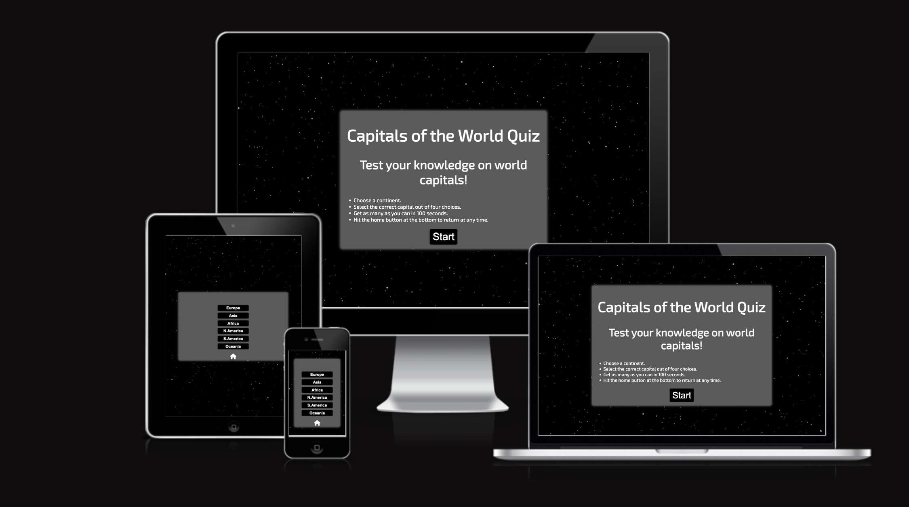

## UX

The site has an outer space style design. There are two reasons for this choice.
The first is that it is to give the user the feeling that they are in space away from Earth and are trying to remember the capitals.
The second reason is that the high contrast of the dark space and the bright question card is dynamic and visually interesting to look at without being too ditracting.

### Colour Scheme

- `white` used for primary text.
- `gray` used for primary highlights.
- `black` used for button background.
- `green` used for correct answer button.
- `red` used for secondary wrong answer button.

### Typography

To fit with the outer space theme I chose to use the Exo-2 font as it has a Sci-fi look. 

Example:

- [Exo 2](https://fonts.google.com/specimen/Exo+2?query=exo) was used for the primary headers and titles.

## User Stories

### New Site Users

- As a new site user, I would like to have a clear start button, so that I can easily choose to start the game when I am ready.
- As a new site user, I would like to have clear buttons to select a continent, so that I can decide which set of countries I want to be tested on.
- As a new site user, I would like to have buttons for each answer, so that I can easily select what I believe to be the correct answer.
- As a new site user, I would like to have the answers change colour when I select them, so that I can clearly see if I selected the right answer.
- As a new site user, I would like to have a score counter at the bottom, so that I can keep track of the questions I got right.
- As a new site user, I would like to have a timer, so that I can challenge myself to answer as many questions as possible.
- As a new site user, I would like to have a home icon, so that I can return to the main menu at any point.

## Wireframes

To follow best practice, wireframes were developed for mobile, tablet, and desktop sizes.
I've used the software pixelmator pro to design my site wireframes.

### Home Page Wireframes

| Size | Screenshot |
| --- | --- |
| Mobile |  |
| Tablet | 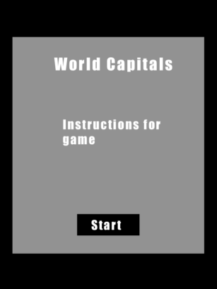 |
| Desktop | 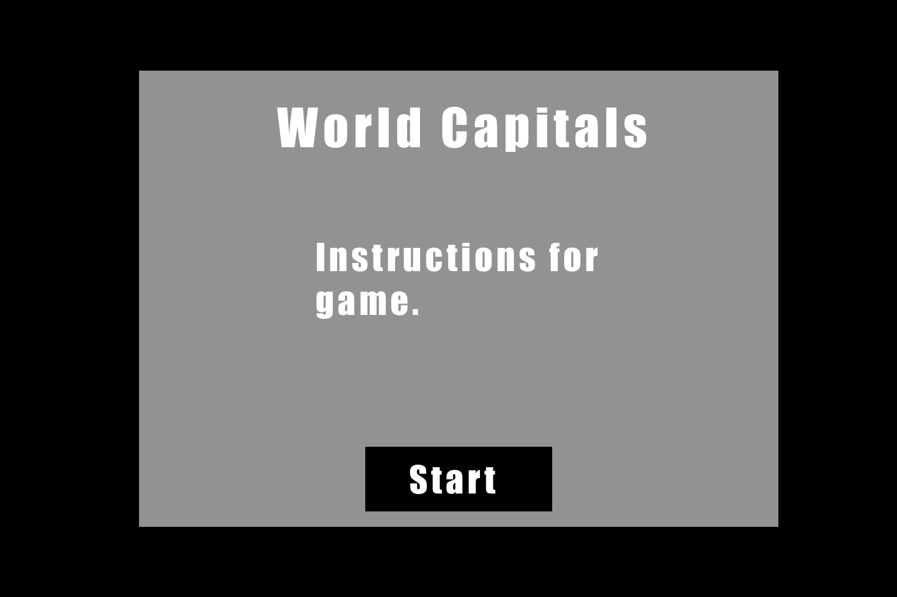 |

### Continent Page Wireframes

| Size | Screenshot |
| --- | --- |
| Mobile | 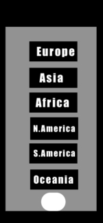 |
| Tablet | 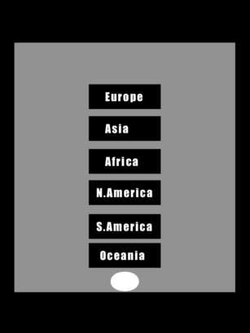 |
| Desktop | 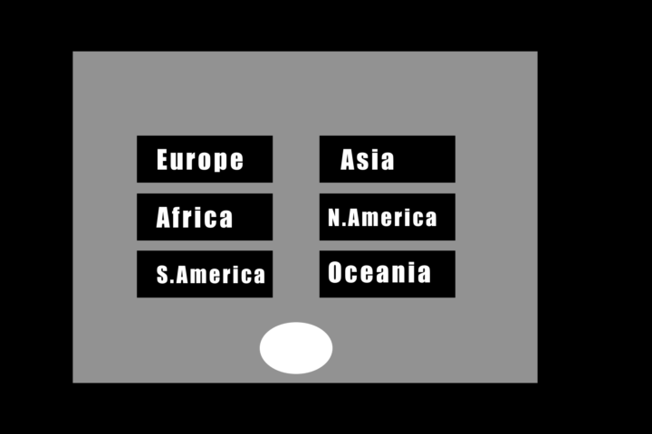 |

### Question Page Wireframes

| Size | Screenshot |
| --- | --- |
| Mobile | 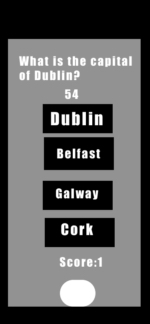 |
| Tablet | 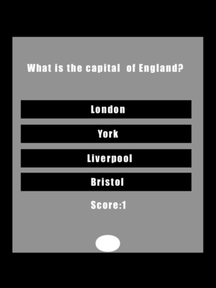 |
| Desktop |  |

### Score Page Wireframes

| Size | Screenshot |
| --- | --- |
| Mobile |  |
| Tablet | 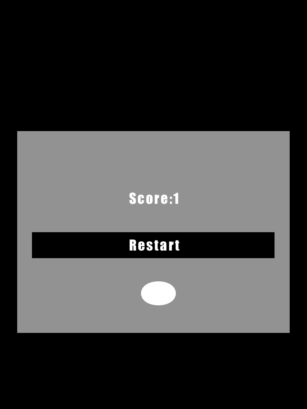 |
| Desktop | 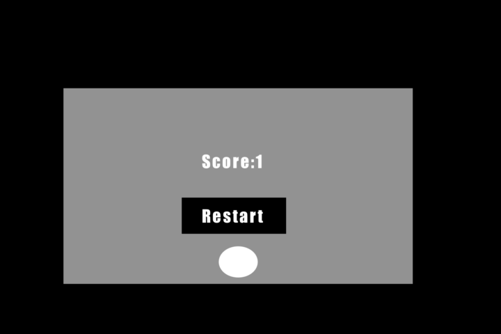 |

Repeat for any addition wireframe pages you have.

## Features

### Existing Features

- **Feature #1**

    - The site has a clear and prominent start button so the user can choose when they want the game to start.

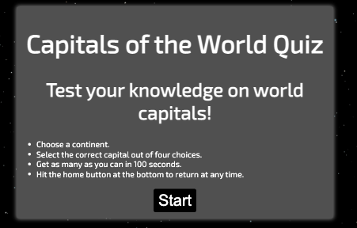

- **Feature #2**

    - The site has clear buttons for each continent so the user can choose what set of countries they want to be tested on.

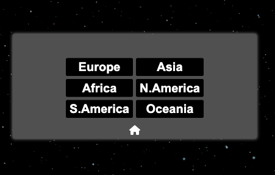

- **Feature #3**

    - The site has clear buttons for the user to choose their answer. The buttons also change colour depending on what answer is chosen to make it obvious if the correct answer was chosen or not.

    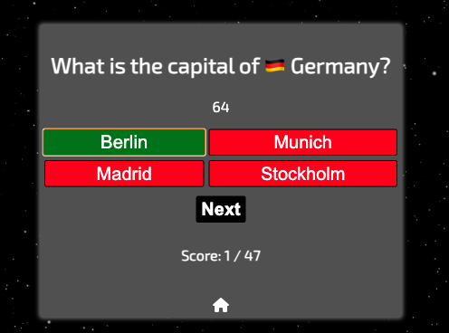

- **Feature #3**

    - Once the game has started a score counter at the bottom will display how many questions the user got right.

    

    - **Feature #4**

    - A timer above the answers shows the user how much time is remaining.

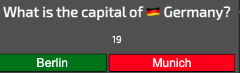

- **Feature #5**

    - A home icon under the question can bring the user back to home page.

    

- **Feature #5**

    - A restart button allows the user to restart the quiz.

    

### Future Features

- New feature #1
    - Add a highscore page where users can store their scores.
- New feature #2
    - Add sound effects and music.

## Tools & Technologies Used

- [HTML](https://en.wikipedia.org/wiki/HTML) used for the main site content.
- [CSS](https://en.wikipedia.org/wiki/CSS) used for the main site design and layout.
- [CSS Flexbox](https://www.w3schools.com/css/css3_flexbox.asp) used for an enhanced responsive layout.
- [JavaScript](https://www.javascript.com) used for user interaction on the site.
- [Git](https://git-scm.com) used for version control. (`git add`, `git commit`, `git push`)
- [GitHub](https://github.com) used for secure online code storage.
- [GitHub Pages](https://pages.github.com) used for hosting the deployed front-end site.
- [Gitpod](https://gitpod.io) used as a cloud-based IDE for development.
- [Markdown Builder by Tim Nelson](https://traveltimn.github.io/markdown-builder) used to help generate the Markdown files.

## Testing

For all testing, please refer to the [TESTING.md](TESTING.md) file.

## Deployment

The site was deployed to GitHub Pages. The steps to deploy are as follows:
- In the [GitHub repository](https://github.com/tpfk7/capitals-of-the-world-quiz), navigate to the Settings tab 
- From the source section drop-down menu, select the **Main** Branch, then click "Save".
- The page will be automatically refreshed with a detailed ribbon display to indicate the successful deployment.

The live link can be found [here](https://tpfk7.github.io/capitals-of-the-world-quiz)

### Local Deployment

This project can be cloned or forked in order to make a local copy on your own system.

#### Cloning

You can clone the repository by following these steps:

1. Go to the [GitHub repository](https://github.com/tpfk7/capitals-of-the-world-quiz) 
2. Locate the Code button above the list of files and click it 
3. Select if you prefer to clone using HTTPS, SSH, or GitHub CLI and click the copy button to copy the URL to your clipboard
4. Open Git Bash or Terminal
5. Change the current working directory to the one where you want the cloned directory
6. In your IDE Terminal, type the following command to clone my repository:
	- `git clone https://github.com/tpfk7/capitals-of-the-world-quiz.git`
7. Press Enter to create your local clone.

Alternatively, if using Gitpod, you can click below to create your own workspace using this repository.

Please note that in order to directly open the project in Gitpod, you need to have the browser extension installed.
A tutorial on how to do that can be found [here](https://www.gitpod.io/docs/configure/user-settings/browser-extension).

#### Forking

By forking the GitHub Repository, we make a copy of the original repository on our GitHub account to view and/or make changes without affecting the original owner's repository.
You can fork this repository by using the following steps:

1. Log in to GitHub and locate the [GitHub Repository](https://github.com/tpfk7/capitals-of-the-world-quiz)
2. At the top of the Repository (not top of page) just above the "Settings" Button on the menu, locate the "Fork" Button.
3. Once clicked, you should now have a copy of the original repository in your own GitHub account!

## Credits

To create the quiz I used a variety of youtube tutorials. The two main tutorials I referenced were:

- [WebDevSimplified](https://www.youtube.com/watch?v=riDzcEQbX6k&ab_channel=WebDevSimplified)
- [BrianDesign](https://www.youtube.com/watch?v=f4fB9Xg2JEY&ab_channel=BrianDesign)

### Content

| Source | Location | Notes |
| --- | --- | --- |
| [Markdown Builder by Tim Nelson](https://traveltimn.github.io/markdown-builder) | README and TESTING | tool to help generate the Markdown files |
| [Chris Beams](https://chris.beams.io/posts/git-commit) | version control | "How to Write a Git Commit Message" |
| [Flexbox Froggy](https://flexboxfroggy.com/) | entire site | modern responsive layouts |
| [Youtube](https://www.youtube.com/watch?v=riDzcEQbX6k&ab_channel=WebDevSimplified) | entire site | quiz |
| [Youtube](https://www.youtube.com/watch?v=f4fB9Xg2JEY&ab_channel=BrianDesign) | entire site | quiz |

### Media

| Source | Location | Type | Notes |
| --- | --- | --- | --- |
| [Storyblocks](https://www.storyblocks.com/) | entire site | background gif | site for royalty free images and videos|
| [Emojipedia](https://emojipedia.org/flags/) | all questions | image | flag emojis used for questions|
| [Worldometer](https://www.worldometers.info/geography/alphabetical-list-of-countries/) | all questions | question info | site that lists all the countries of the world|
| [WorldCapitalCities](hhttps://geographyfieldwork.com/WorldCapitalCities.htm/) | all questions | question info | site that lists all the capitals of the world|

### Acknowledgements

- I would like to thank my Code Institute mentor, [Tim Nelson ](https://github.com/TravelTimN) for their support throughout the development of this project.
- I would like to thank the [Code Institute](https://codeinstitute.net) tutor team for their assistance with troubleshooting and debugging some project issues.
- I would like to thank the [Code Institute Slack community](https://code-institute-room.slack.com) for the moral support; it kept me going during periods of self doubt and imposter syndrome.
- I would like to thank [Chris Quin ](https://github.com/10xoxr)for their support in the master classes.
